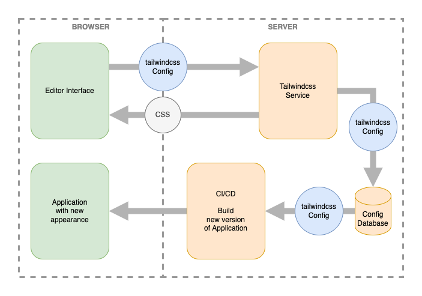
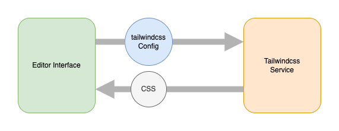
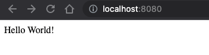
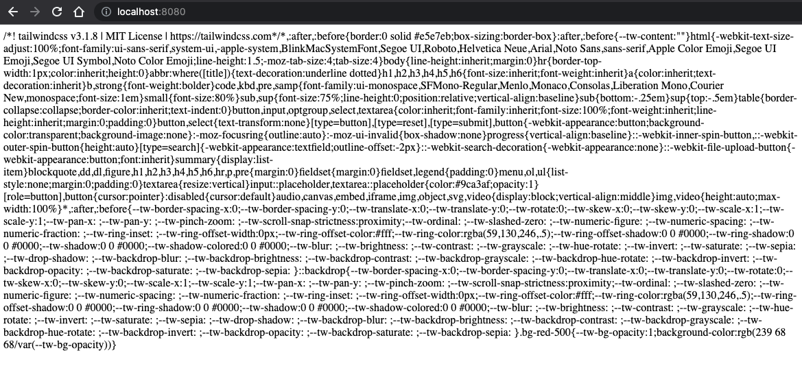
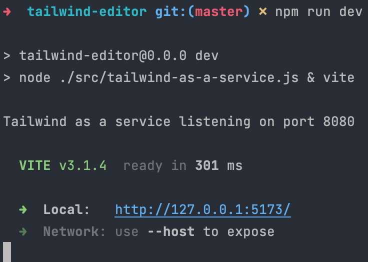
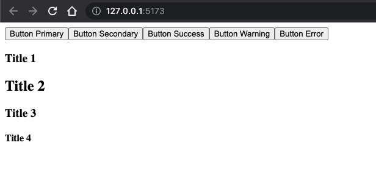
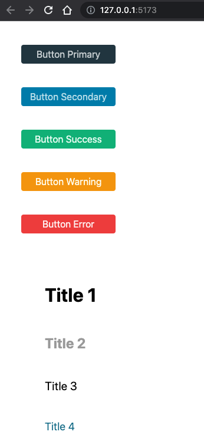
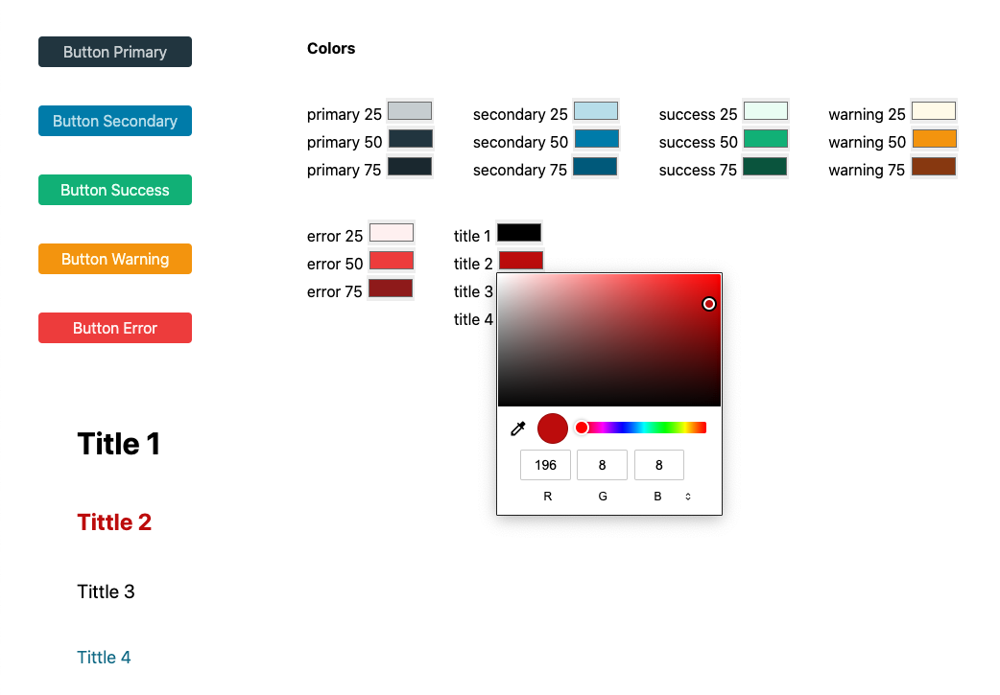
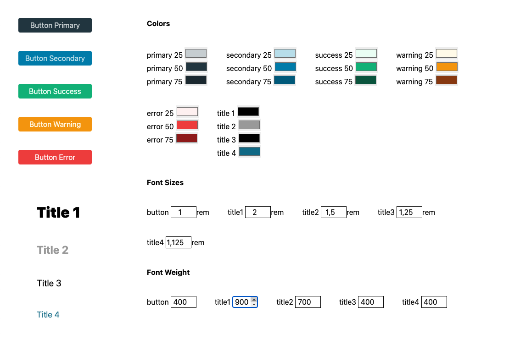

# Tailwind + Vue No-code editor

There has been a lot of talk about no-code solutions lately. This movement tries to approach non-developers by offering software development tools that allow them to create and modify applications without using code. The benefits of no-code tools include speed, accessibility, reduced costs and autonomy.

Thinking about this idea, I wondered how to create a no-code editor for a web application. But, since a tool like this would be huge for a single post, I decided to focus only on the personalization of the styles and themes.

So, I chose to rely on one of the most popular CSS frameworks at the moment: Tailwind. Not because of its usual use, but for all the tools it has in terms of configuration and CSS generation.

The idea is to create a frontend interface which allows the [Tailwind configuration](https://tailwindcss.com/docs/configuration) to be modified in real time and shows the result styles applied. Then, this customized configuration could be stored and used in the build and deployment process of a hypothetical application.



However, in this article, we are going to focus only on the editor and how to achieve a real-time preview of the Tailwind config changes.



To do so, we are going to create a simple service in Node using [ExpressJs](https://expressjs.com/). This service will receive the Tailwind configuration from the frontend editor and run [PostCSS](https://postcss.org/) with the Tailwind plugin to generate the CSS. Finally, the service will return the generated CSS to the editor, which will update the page to show the changes.

> We could try to run the PostCSS and Tailwind plugin directly in the browser, make it work with node polyfills; that is how is done in [Tailwind Play's](https://play.tailwindcss.com/) internal implementation. Another option would be use [Web Containers](https://blog.stackblitz.com/posts/introducing-webcontainers/), but for simplicity's sake, we are going to run it in a simple node service.
>

## Creating the Project

Let’s create the new project called `tailwind-editor` with [Vite](https://vitejs.dev/) running `npm create`. I’m going to use [Vue](https://vuejs.org/) for the Frontend because I’m more comfortable with it and also because it is awesome 😉.

```bash
$ dev npm create vite@latest
✔ Project name: … tailwind-editor
✔ Select a framework: › Vue
✔ Select a variant: › JavaScript
```

Then, add the dependencies for the service.

```bash
$ cd tailwind-editor
$ npm install --save express cors postcss tailwindcss
```

The resulting package:

```json
{
  "name": "tailwind-editor",
  "private": true,
  "version": "0.0.0",
  "type": "module",
  "scripts": {
    "dev": "vite",
    "build": "vite build",
    "preview": "vite preview"
  },
  "dependencies": {
    "cors": "^2.8.5",
    "express": "^4.18.1",
    "postcss": "^8.4.17",
    "tailwindcss": "^3.1.8",
    "vue": "^3.2.37"
  },
  "devDependencies": {
    "@vitejs/plugin-vue": "^3.1.0",
    "vite": "^3.1.0"
  }
}
```

## Creating the Tailwind Service

Now, we are going to create the service that will receive the Tailwind config and return the resulting CSS.

Let’s start with a file `src/tailwind-as-a-service.js` which will contain the [Express](https://expressjs.com/) server with the `cors` middleware to support [cross-origin](https://developer.mozilla.org/en-US/docs/Web/HTTP/CORS) calls. It is listening by port 8080 to any request to the root path with a `GET` method and returns the text `Hello World`.

```jsx
// src/tailwind-as-a-service.js

import express from 'express';
import cors from 'cors';

const app = express()
app.use(cors());
const port = 8080

app.get('/', (req, res) => {
  res.send('Hello World!')
})

app.listen(port, () => {
  console.log(`Tailwind as a service listening on port ${port}`)
})
```

Running the server in node lets you check the response directly in the browser:

```bash
$ node ./src/tailwind-as-a-service.js
```



> Since we are using Vite and [ES modules](https://developer.mozilla.org/en-US/docs/Web/JavaScript/Guide/Modules), the minimum node version required to follow this article is 14.18+.
>

So far, so good. Now we are going to configure `postcss` and its Tailwind plugin to return CSS:

```jsx
// src/tailwind-as-a-service.js
......
import postcss from 'postcss';
import tailwindcss from 'tailwindcss';

......

const defaultCss = `
  @import 'tailwindcss/base';
  @import 'tailwindcss/components';
  @import 'tailwindcss/utilities';
`;

app.get('/', async (req, res) => {
  const configuredTailwind = tailwindcss({
    content: [{ raw: '<div class="bg-red-500">', extension: 'html' }]
  });
  const postcssProcessor = postcss([configuredTailwind]);
  const { css } = await postcssProcessor.process(defaultCss);
  res.send(css);
});

......
```

We just added the `postcss` and `tailwindcss` dependencies. Next, we have to configure the Tailwind plugin for PostCSS with the [content](https://tailwindcss.com/docs/content-configuration) option.

This option tells Tailwind to inspect the HTML, JavaScript components, and other files, to look for CSS classes to generate and include its CSS in the final result. It also allows us to write raw HTML inline.

After that, it is time to create a `postcssProcessor` with the configured Tailwind plugin, which is responsible for parsing the CSS and applying all PostCSS plugins.

Finally, we process a “fake” CSS file with the default base, components and utility styles of Tailwind. This is necessary to make Tailwind generate all necessary CSS.

The result CSS is returned in the response. So if we run the service with `node ./src/tailwind-as-a-service.js` again, and we request it from the browser, the resulting CSS will be shown:



Here, you can see [the base CSS Tailwind provides by default](https://tailwindcss.com/docs/preflight) and also the `.bg-red-500` class at the end that we are passing as raw HTML to the Tailwind config.

So, we have a service to request and return the CSS, but how do we configure that CSS? Let’s make this service receive parameters and use them to configure the Tailwind plugin:

```javascript
// src/tailwind-as-a-service.js
......

const defaultCss = `
  @import 'tailwindcss/base';
  @import 'tailwindcss/components';
  @import 'tailwindcss/utilities';
`;

app.post('/', async (req, res) => {
  const configuredTailwind = tailwindcss({
    content: [{ raw: req.body.html, extension: 'html' }],
    theme: req.body.theme
  });
  const postcssProcessor = postcss([configuredTailwind]);
  const { css } = await postcssProcessor.process(defaultCss);
  res.send(css);
});

......
```

Here, we changed the `.get` method into `.post` to be able to send and receive parameters in the request body, for larger parameters.

Moreover, we pick `html` and `theme` parameters from the request body and use them to [configure Tailwind](https://tailwindcss.com/docs/configuration).

> For simplicity, we are using only the `theme` part of the Tailwind configuration, but this approach, allows any part of the [Tailwind configuration](https://tailwindcss.com/docs/configuration).
>

## Creating the Editor

We are going to define some custom configurations for the Tailwind theme, which users will be able to modify through an interface. Below are the defined values for a simple example of components: buttons and titles. To keep the scope small, for this example we only allow some colors and font properties to be changed:

```jsx
// src/custom-tailwind-config.js

export const customTailwindConfig = {
  colors: {
    primary: {
      25: '#cdd3d6',
      50: '#243d48',
      75: '#1b2d36'
    },
    secondary: {
      25: '#bfe1ec',
      50: '#0086b2',
      75: '#006485'
    },
    success: {
      25: '#ecfdf5',
      50: '#10b981',
      75: '#065f46'
    },
    warning: {
      25: '#fffbeb',
      50: '#f59e0b',
      75: '#92400e'
    },
    error: {
      25: '#fef2f2',
      50: '#ef4444',
      75: '#991b1b'
    },
    title: {
      1: '#000',
      2: '#a3a3a3',
      3: '#000',
      4: '#0e7490'
    }
  },
  fontSize: {
    button: '1rem',
    'size-title1': '2rem',
    'size-title2': '1.5rem',
    'size-title3': '1.25rem',
    'size-title4': '1.125rem'
  },
  fontWeight: {
    'weight-button': '400',
    'weight-title1': '700',
    'weight-title2': '700',
    'weight-title3': '400',
    'weight-title4': '400'
  }
};
```

> Keep in mind that we are using the Tailwind theme configuration for the sake of simplicity – it is not the only way to achieve the same result. The whole Tailwind configuration could be overridden, including the [plugins](https://tailwindcss.com/docs/plugins) used and/or their configuration. For example, you could create your own Tailwind plugin and adding all your CSS components based on a configuration passed to the plugin. This configuration could be passed as a parameter to the Tailwind service as we are doing here with the theme configuration.
>

The next step is to go to the `App.vue` component and remove all default content, then add some buttons and titles using the CSS utility classes that Tailwind generates with the theme configuration that was just defined:

```html
// src/App.vue

<template>
  <section class="flex flex-col gap-10 min-w-[200px] m-10">
    <section class="flex flex-col gap-10">
      <button class="w-40 h-8 rounded bg-primary-50 hover:bg-primary-75 text-primary-25 hover:text-primary-25 text-button font-weight-button">
        Button Primary
      </button>
      <button class="w-40 h-8 rounded bg-secondary-50 hover:bg-secondary-75 text-secondary-25 hover:text-secondary-25 text-button font-weight-button">
        Button Secondary
      </button>
      <button class="w-40 h-8 rounded bg-success-50 hover:bg-success-75 text-success-25 hover:text-success-25 text-button font-weight-button">
        Button Success
      </button>
      <button class="w-40 h-8 rounded bg-warning-50 hover:bg-warning-75 text-warning-25 hover:text-warning-25 text-button font-weight-button">
        Button Warning
      </button>
      <button class="w-40 h-8 rounded bg-error-50 hover:bg-error-75 text-error-25 hover:text-error-25 text-button font-weight-button">
        Button Error
      </button>
    </section>
  
    <section class="flex flex-col gap-10 m-10">
      <h1 class="text-title-1 text-size-title1 font-weight-title1">
        Title 1
      </h1>
      <h2 class="text-title-2 text-size-title2 font-weight-title2">
        Title 2
      </h2>
      <h3 class="text-title-3 text-size-title3 font-weight-title3">
        Title 3
      </h3>
      <h4 class="text-title-4 text-size-title4 font-weight-title4">
        Title 4
      </h4>
    </section>
  </section>
  </section>
</template>
```

Before running the `dev` script to serve the Vue project, we need to modify this script in `package.json` to parallelize its execution with the Tailwind service:

```json
"dev": "node ./src/tailwind-as-a-service.js & vite",
```

Afterwards, we run the project and visit the locally served URL:

```bash
$ npm run dev
```

We are using the [latest version of Vite](https://github.com/vitejs/vite/blob/main/packages/vite/CHANGELOG.md), so the default port is `5153`:



Finally, we open that URL in the browser and… oops! no styles?! What’s going on? 🤯



The styles are not being applied because we are not using Tailwind directly in our Vue project as we normally would. Instead, we have to call the `tailwind-as-a-service` endpoint to retrieve the CSS. Okay then, let’s create the function to call the service.

We create a new file `fetch-css.js` in the `src` directory:

```jsx
// src/fetch-css.js

export async function fetchCss(tailwindCustomConfig) {
  return await fetch('http://localhost:8080', {
    method: 'POST',
    headers: { 'content-type': 'application/json' },
    body: JSON.stringify({
      html: document.body.innerHTML,
      theme: {
        extend: tailwindCustomConfig
      }
    })
  }).then(response => response.text());
}

```

This `async` function is receiving the custom Tailwind config and fetching the Tailwind service, passing it as the `theme:{ extend: tailwindCustomConfig }` parameter. We pass it inside `extend` to [keep all the default utilities Tailwind has](https://tailwindcss.com/docs/theme#extending-the-default-theme), and only add the new ones we need. We also obtain all the current HTML on the page and send it to the service as the `html` parameter. Tailwind will use this HTML to know which CSS classes generate and which don't.

The following step is to create a new component `Editor.vue` to use that function:

```html
// src/components/Editor.vue

<script setup>
  import { onMounted, ref } from 'vue';
  import { customTailwindConfig } from '../custom-tailwind-config.js';
  import { fetchCss } from '../fetch-css.js';

  const css = ref('');

  async function getCss() {
    css.value = await fetchCss(customTailwindConfig);
  }

  onMounted(getCss);
</script>

<template>
  <component is="style">{{ css }}</component>
</template>
```

There are many things going on here. Let’s take a closer look:

- We import the previous `customTailwindConfig` and the `fetchCss` function.
- We add a `css` ref. If you are not already familiar with it, [check out the new Vue Composition API documentation](https://vuejs.org/api/composition-api-setup.html#basic-usage).
- We create a new function `getCss` which calls the `fetchCss` and assigns the returned promise value to the `ref` value.
- We use the `onMounted` [Vue lifecycle hook](https://vuejs.org/api/composition-api-lifecycle.html#onmounted) to call the previous function whenever the component is mounted.
- Finally, we create a [dynamic component](https://vuejs.org/guide/essentials/component-basics.html#dynamic-components) to attach the CSS to the DOM. This dynamic component will render the CSS inside a `<style>` tag, when the `css` ref is updated. That way, whenever we update the `css` ref value, the styles will be updated.

> We use a dynamic component as a workaround because, in the Vue template compiler the `<style>` tag is not allowed inside the `<template>` tag.
>

Now, we import and use the `Editor.vue` component inside the `App.vue`:

```html
// src/App.vue

<template>

  <div class="flex flex-row">
		......

    <Editor/>
  </div>
</template>

<script setup>
  import Editor from './components/Editor.vue';
</script>
```

Ready to see the styles? Reload the URL and they will appear:



Finally, the last step is to make the `Editor.vue` modify the default theme from the Tailwind configuration and request the CSS again from the service to see a live view of the changes.

We are starting with the colours, adding a color picker for each color we want to configure.

```html
// src/components/Editor.vue
<script setup>
  import { onMounted, reactive, ref, watch } from 'vue';
  ......

  const css = ref('');
  const editableCustomConfig = reactive(customTailwindConfig);

  async function getCss() {
    css.value = await fetchCss(editableCustomConfig);
  }

  onMounted(getCss);
  watch(editableCustomConfig, getCss);

</script>

<template>

  <div class="flex flex-col flex-nowrap gap-10 w-1/2  m-10">

    <h2 class="font-bold">Colors</h2>
    <section class="flex flex-row flex-wrap gap-10">

      <div v-for="(color, colorName) in editableCustomConfig.colors"
           style="display: flex; flex-flow: column nowrap;">
        <label v-for="(_, shadeName) in color">{{ colorName }} {{ shadeName }}
          <input type="color" v-model.lazy="color[shadeName]">
        </label>
      </div>

    </section>
  </div>

  <component is="style">{{ css }}</component>
</template>
```

In this step, we are making several changes to be able to modify the configuration reactively:

- In the `<script>`:
  - First, we create a [reactive object](https://vuejs.org/api/reactivity-core.html#reactive) with our `customTailwindConfig` as the initial value.
  - Then we fetch the CSS with this reactive object.
  - Finally, we add a [`watch`](https://vuejs.org/guide/essentials/watchers.html) to call the `getCss` function, whenever this reactive object changes
- In the `<template>`:
  - We add two loops [`v-for`](https://vuejs.org/api/built-in-directives.html#v-for) to iterate over each color and each shade, binding a color picker to the value.
  - We use the [`v-model`](https://vuejs.org/api/built-in-directives.html#v-model) directive with the [`lazy`](https://vuejs.org/guide/essentials/forms.html#lazy) modifier so that not too many requests are made whenever we move the selector over the color picker.

  > Notice, we are binding the color shade to the `v-model` using the color and the shade name, instead of using the `v-for` variable directly. This is because the variable used to iterate in the `v-for` loops cannot be modified; the workaround lets us access the value indirectly.
  >

  If we run the application again, we can see the color pickers. Now, by changing a color, the component using that color will be updated automatically:

  


Finally, we configure font size and font weight:

```html
// src/components/Editor.vue
<script setup>
......
</script>

<template>
......

    <h2 class="font-bold">Font Sizes</h2>
    <section class="flex flex-row flex-wrap gap-10">
      <label v-for="(_, sizeName) in editableCustomConfig.fontSize">{{
          sizeName.replace('size-', '')
        }}
        <input type="number"
               step="0.125"
               class="w-14 border border-black text-center"
               :value="editableCustomConfig.fontSize[sizeName].replace('rem','')"
               @input="event=> editableCustomConfig.fontSize[sizeName] = event.target.value + 'rem'">rem
      </label>
    </section>

    <h2 class="font-bold">Font Weight</h2>
    <section class="flex flex-row flex-wrap gap-10">
      <label v-for="(_, weightName) in editableCustomConfig.fontWeight">{{
          weightName.replace('weight-', '')
        }}
        <input type="number"
               step="100"
               min="100"
               max="900"
               class="w-14 border border-black text-center"
               v-model="editableCustomConfig.fontWeight[weightName]">
      </label>
    </section>
  </div>

  <component is="style">{{ css }}</component>
</template>
```

Here, we are repeating the same principle used for the colours, but with a single `v-for` for each case. Moreover, for the case of font size, the `rem` unit has to be added and removed to the Tailwind configuration.

Alright, the moment you have been waiting for has arrived! This is what the editor looks like:



This editor is the starting point for creating your own no-code tool that allows you to configure your project and see the changes on the fly. Remember that using theme values is not the only way to make this configurable; you can also use all the Tailwind config options.

## Why not CSS custom properties, AKA CSS variables?

Sure, we could achieve exactly the same result by using CSS variables as values in the Tailwind theme configuration. Modifying the value of these variables in the front would remove need to use any additional service and adapt the Tailwind process on the fly.

Then, after saving these variables and loading them in production, the changes would be deployed.

But there’s a reason, promise!


In this example, we are only modifying the theme part of the Tailwind configuration, but there are [plenty more options](https://tailwindcss.com/docs/configuration) in that configuration.

Imagine you created a [Tailwind plugin](https://tailwindcss.com/docs/plugins) which adds your own Design Components and CSS utilities. These plugins can [have options](https://tailwindcss.com/docs/plugins#exposing-options) too.

So, with the solution laid out here, you can modify all these possible configurations and options and see the results immediately.

Also, you can use the service created to directly save the configuration in your database (by user or customer) to later retrieve it during the deployment process or for any other purpose you need.

Ready to get started? All the [working code is available here](https://github.com/tajespasarela/tailwind-editor). Please, feel free to open issues and give feedback. Also, if you find it useful, a star would be much appreciated 😉.
